# TP 2 - Backend API

> Cours : **Développement Web Fullstack** — M1, Ynov
> Séance n°2 · Backend Fundamentals · HTTP · REST · CRUD · Express · Postman

API REST construite avec **Node.js** et **Express** (😢), permettant la gestion d'utilisateurs en mémoire.

## Objectifs du TP

- Comprendre les méthodes HTTP (GET, POST, PUT, DELETE) et les codes de statut
- Maîtriser les principes REST et CRUD
- Structurer une API Express avec des routes organisées
- Tester les endpoints avec Postman ou Insomnia
- Gérer les erreurs et retourner des réponses HTTP appropriées

## Fonctionnalités

- Lister tous les utilisateurs
- Récupérer un utilisateur par son identifiant
- Créer un nouvel utilisateur
- Modifier un utilisateur existant
- Supprimer un utilisateur
- Logging automatique de chaque requête entrante (méthode, URL, durée)

## Routes disponibles

| Méthode | Route | Description | Codes retour |
|---------|-------|-------------|--------------|
| `GET` | `/api/users` | Récupère la liste de tous les utilisateurs | 200 |
| `GET` | `/api/users/:id` | Récupère un utilisateur par son id | 200, 404 |
| `POST` | `/api/users` | Crée un nouvel utilisateur | 201, 400, 409 |
| `PUT` | `/api/users/:id` | Met à jour un utilisateur existant | 200, 404, 409 |
| `DELETE` | `/api/users/:id` | Supprime un utilisateur | 204, 404 |

### Détail des codes de statut

| Code | Signification | Cas d'usage |
|------|--------------|-------------|
| 200 | OK | Requête réussie, données retournées |
| 201 | Created | Utilisateur créé avec succès |
| 204 | No Content | Suppression réussie, aucune donnée retournée |
| 400 | Bad Request | Champs obligatoires manquants (`name`, `email`) |
| 404 | Not Found | Aucun utilisateur trouvé pour cet id |
| 409 | Conflict | L'adresse email est déjà utilisée |

## Lancer le serveur

```bash
npm install
npm start
```

Le serveur écoute sur `http://localhost:3001`.

---

## Scénarios de test TP 2

> Les captures d'écran ci-dessous correspondent aux scénarios de test du **TP 2**.

### 1. GET /api/users — Récupérer tous les utilisateurs
Vérifier que les 3 utilisateurs initiaux sont retournés (code 200).


---

### 2. POST /api/users — Créer un nouvel utilisateur
Créer un nouvel utilisateur et noter l'id retourné (code 201).


---

### 3. GET /api/users/:id — Récupérer l'utilisateur créé
Récupérer l'utilisateur créé avec son id (code 200).

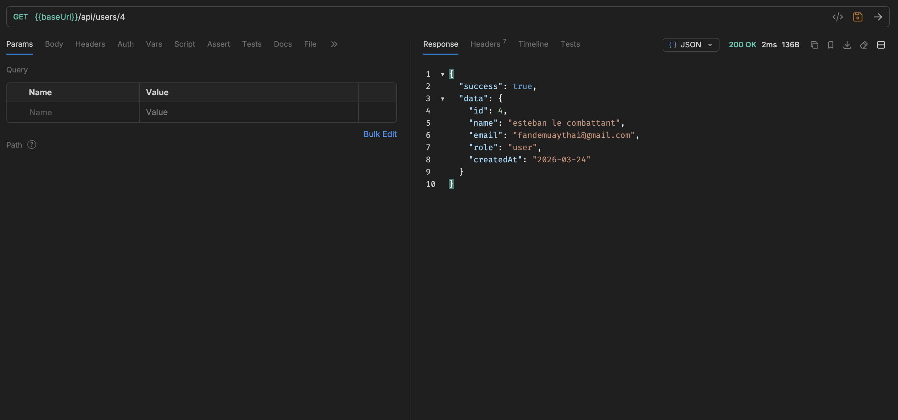

---

### 4. PUT /api/users/:id — Modifier le rôle de l'utilisateur
Modifier le rôle de l'utilisateur créé (code 200).

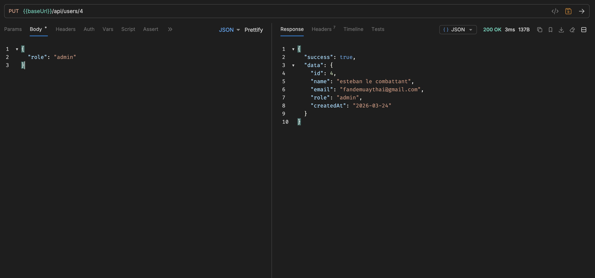

---

### 5. GET /api/users — Vérifier la liste mise à jour
Vérifier que la liste contient maintenant 4 utilisateurs (code 200).

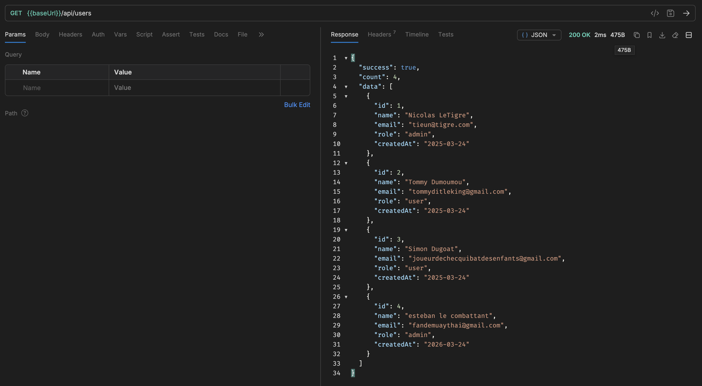

---

### 6. DELETE /api/users/:id — Supprimer l'utilisateur créé
Supprimer l'utilisateur créé (code 204).


---

### 7. GET /api/users/:id — Utilisateur introuvable
Tenter de récupérer l'utilisateur supprimé (code 404).

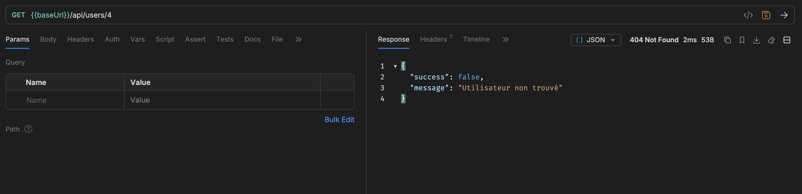

---

## Tâche 3.2 — Tests des cas d'erreur TP 2

### 1. POST /api/users sans name ni email — Bad Request
Créer un utilisateur sans fournir les champs obligatoires (code 400).

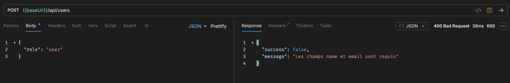

---

### 2. GET /api/users/9999 — Utilisateur inexistant
Récupérer un utilisateur avec un id inexistant (code 404).

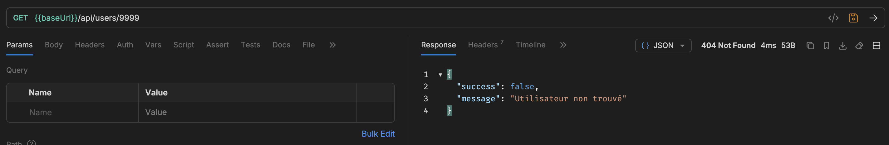

---

### 3. PUT /api/users/9999 — Modification d'un utilisateur inexistant
Modifier un utilisateur avec un id inexistant (code 404).

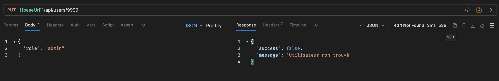

---

### 4. DELETE /api/users/9999 — Suppression d'un utilisateur inexistant
Supprimer un utilisateur avec un id inexistant (code 404).

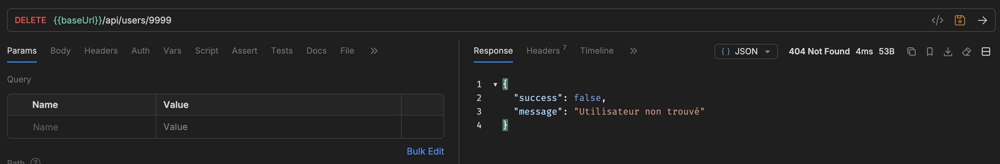

---

## Scénarios de test TP 3

> Les captures d'écran ci-dessous correspondent aux scénarios de test du **TP 3** (migration vers MongoDB).

### 1. GET /api/users — Récupérer tous les utilisateurs
Vérifier que la liste des utilisateurs est retournée depuis MongoDB (code 200).

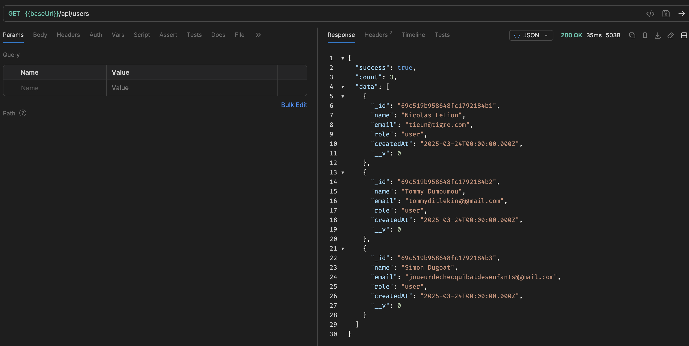

---

### 2. POST /api/users — Créer un nouvel utilisateur
Créer un nouvel utilisateur et noter l'id retourné (code 201).

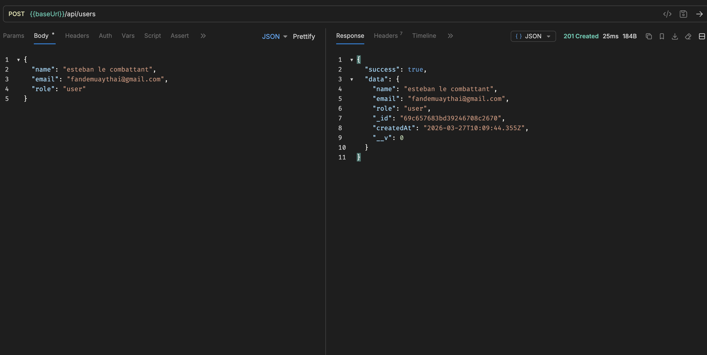

---

### 3. GET /api/users/:id — Récupérer l'utilisateur créé
Récupérer l'utilisateur créé avec son id (code 200).

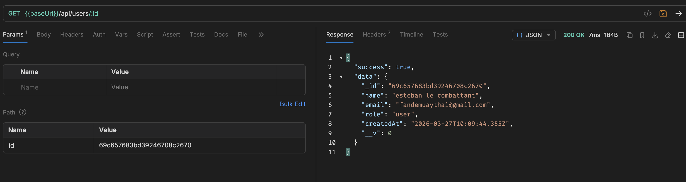

---

### 4. PUT /api/users/:id — Modifier le rôle de l'utilisateur
Modifier le rôle de l'utilisateur créé (code 200).

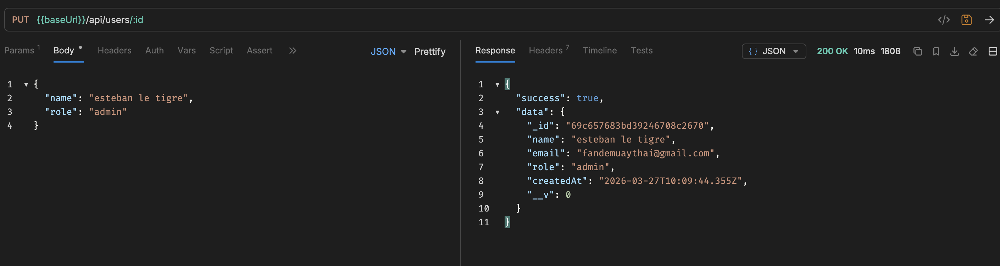

---

### 5. GET /api/users — Vérifier la liste mise à jour
Vérifier que la liste contient le nouvel utilisateur (code 200).

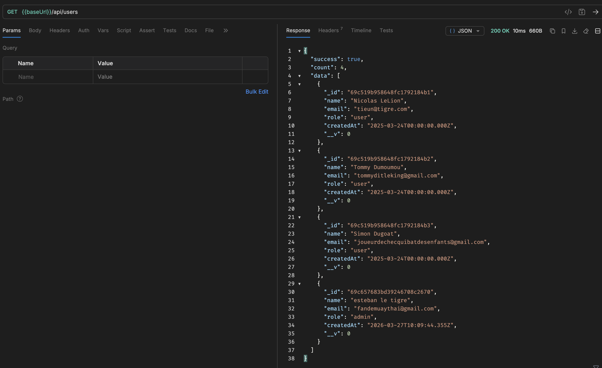

---

### 6. DELETE /api/users/:id — Supprimer l'utilisateur créé
Supprimer l'utilisateur créé (code 204).

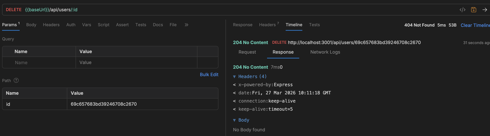

---

### 7. GET /api/users/:id — Utilisateur introuvable
Tenter de récupérer l'utilisateur supprimé (code 404).

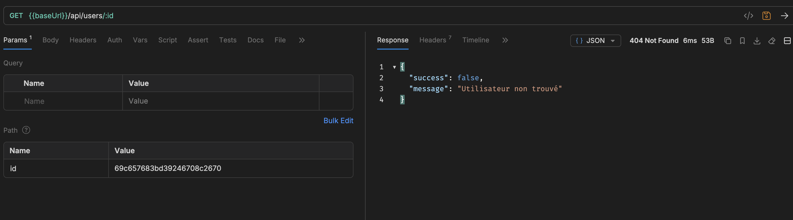

---

## Tâche 4.2 — Tests des cas d'erreur MongoDB

> Les captures d'écran ci-dessous correspondent aux tests des cas d'erreur du **TP 3** avec MongoDB.

### 1. POST /api/users — Email déjà existant
Créer un utilisateur avec une adresse email déjà utilisée (code 409 Conflict).

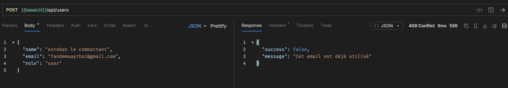

---

### 2. GET /api/users/id_invalide — ObjectId invalide
Récupérer un utilisateur avec un id invalide (ex: `123`) (code 400 Bad Request).

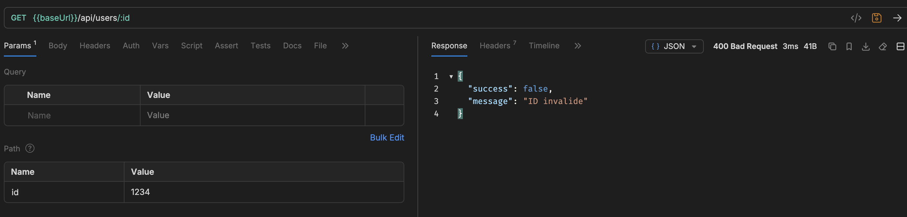

---

### 3. GET /api/users/000000000000000000000000 — ObjectId valide mais inexistant
Récupérer un utilisateur avec un ObjectId valide mais inexistant en base (code 404 Not Found).

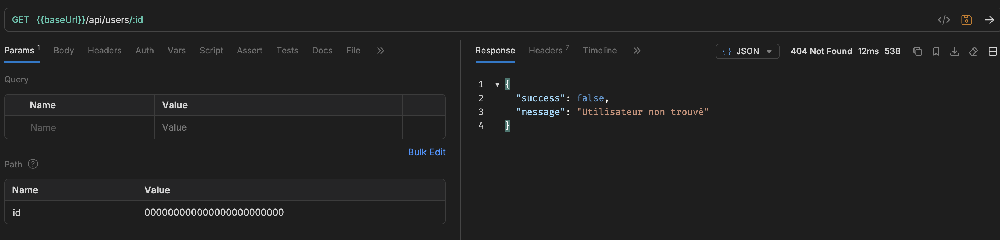

---

### 4. DELETE /api/users/id_invalide — ObjectId invalide
Supprimer un utilisateur avec un id invalide (code 400 Bad Request). Le même comportement s'applique pour `PUT /api/users/id_invalide`.

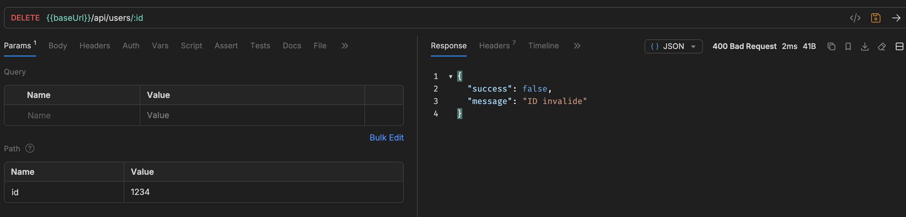
