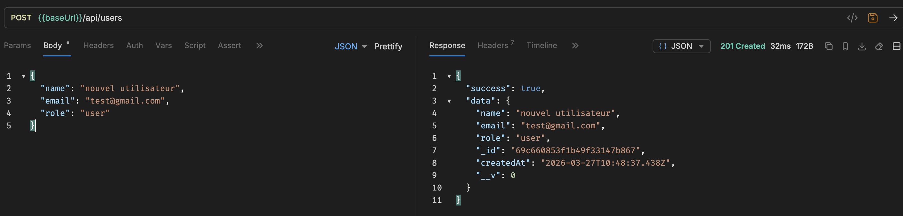
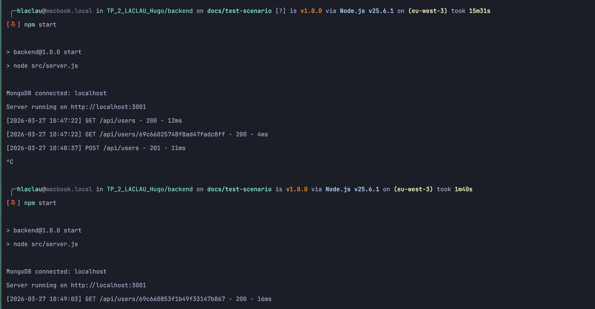
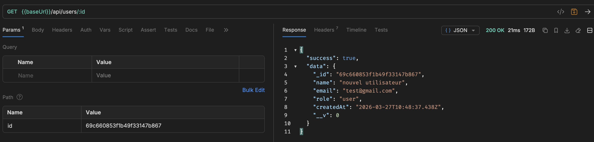

# TP 3 — Test de persistance

[← Sommaire](../README.md) | [← Tests d'erreur TP 3](tp3-errors.md)

---

Ce test valide l'objectif principal du TP : les données survivent au redémarrage du serveur.

## Table des matières

1. [Créer un utilisateur et noter son `_id`](#1-post-apiusers--créer-un-utilisateur-et-noter-son-_id)
2. [Redémarrer le serveur](#2-redémarrer-le-serveur)
3. [Retrouver l'utilisateur après redémarrage](#3-get-apiusers_id--retrouver-lutilisateur-après-redémarrage)

---

### 1. POST /api/users — Créer un utilisateur et noter son `_id`

---

### 2. Redémarrer le serveur

Arrêter le serveur (`Ctrl+C`) puis le relancer (`node server.js`).

---

### 3. GET /api/users/:_id — Retrouver l'utilisateur après redémarrage

L'utilisateur créé avant le redémarrage doit toujours être accessible (code 200).

---

[← Sommaire](../README.md) | [← Tests d'erreur TP 3](tp3-errors.md)
