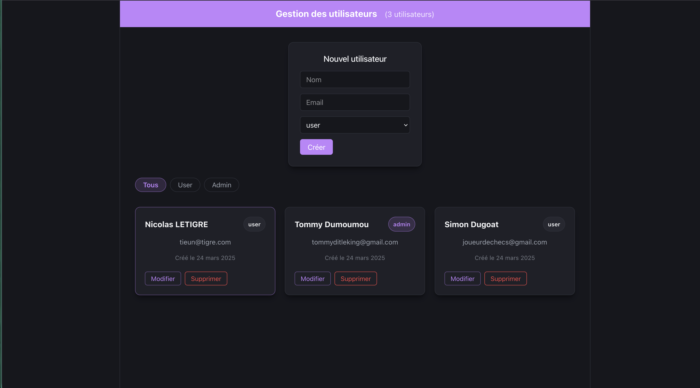
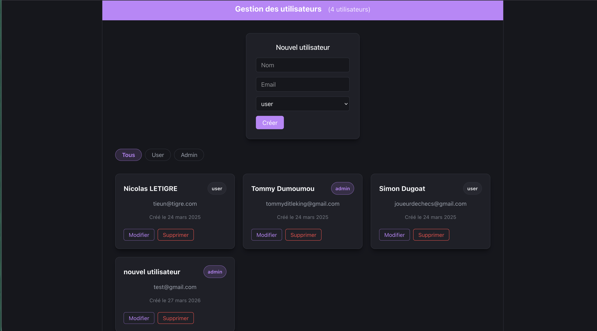
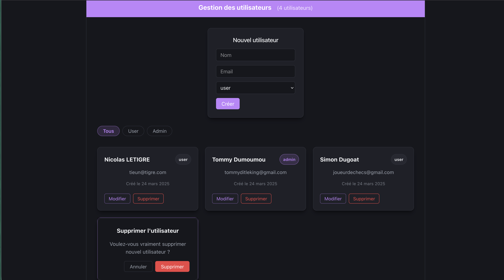
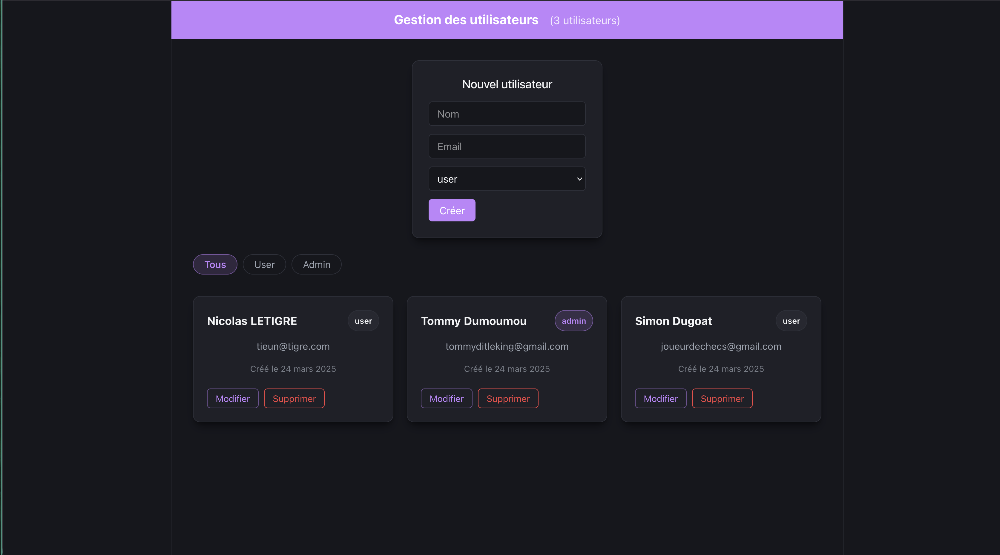
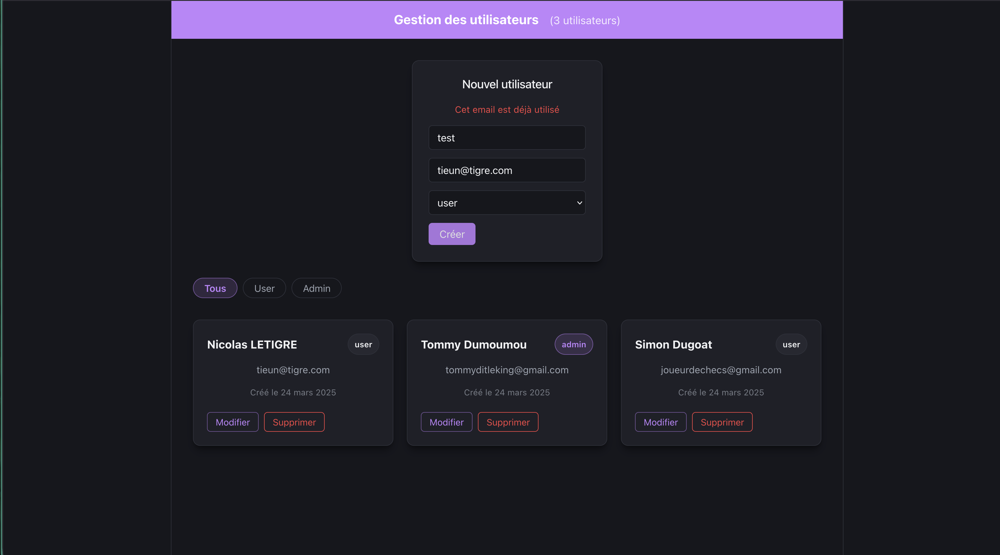
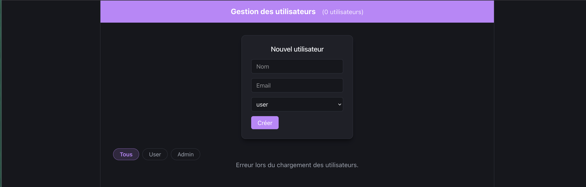
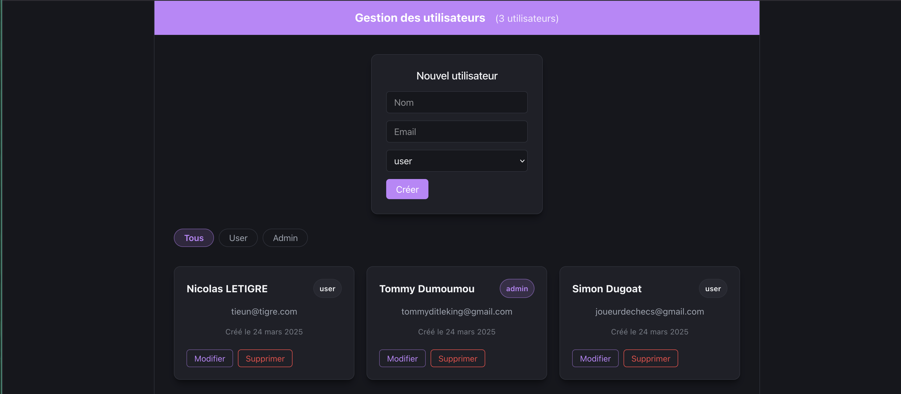

# TP 4 — Scénarios de test

[← Sommaire](../README.md) | [← Vue d'ensemble TP 4](tp4.md)

---

Parcours de test manuel de l'interface React connectée au backend MongoDB.

## Table des matières

1. [La liste des utilisateurs s'affiche](#1-la-liste-des-utilisateurs-saffiche)
2. [Créer un utilisateur](#2-créer-un-utilisateur)
3. [Supprimer un utilisateur](#3-supprimer-un-utilisateur)
4. [Validation des champs obligatoires](#4-validation-des-champs-obligatoires)
5. [Email déjà utilisé](#5-email-déjà-utilisé)
6. [API indisponible](#6-api-indisponible)
7. [Persistance des données](#7-persistance-des-données)

---

### 1. La liste des utilisateurs s'affiche

Lancer le frontend (`npm run dev`). Les utilisateurs chargés depuis l'API apparaissent directement au chargement de la page.

---

### 2. Créer un utilisateur

Remplir et soumettre le formulaire. Le nouvel utilisateur apparaît dans la liste sans rechargement de la page, et un message de succès s'affiche.

---

### 3. Supprimer un utilisateur

Cliquer sur "Supprimer" sur une carte. Une modale de confirmation s'affiche (3.1), puis l'utilisateur disparaît immédiatement de la liste après confirmation (3.2).

---

### 4. Validation des champs obligatoires

Soumettre le formulaire avec un champ vide. Un message d'erreur de validation s'affiche, aucun appel API n'est effectué.

---

### 5. Email déjà utilisé

Soumettre avec un email déjà présent en base. L'erreur 409 retournée par l'API s'affiche dans le formulaire.

---

### 6. API indisponible

Couper le backend (Ctrl+C) et recharger la page. Un message d'erreur s'affiche, l'application ne plante pas.

---

### 7. Persistance des données

Redémarrer le backend et recharger la page. Les données persistent grâce à MongoDB.

---

[← Sommaire](../README.md) | [← Vue d'ensemble TP 4](tp4.md)
